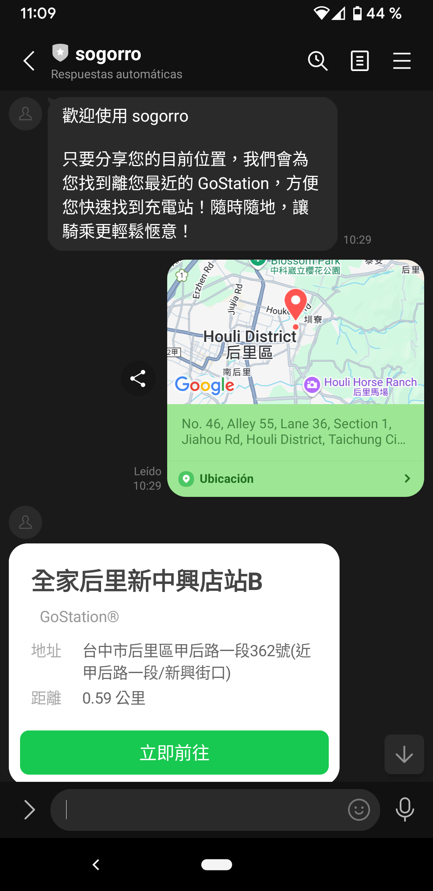

# Sogorro 

透過 Line 分享定位，快速查找最近的 Gogoro 充電站。

## Features
+ 服務部署於 **Cloud Run**
+ GoStation 資料儲存在 **Firestore**
+ Line Channel Access Token 儲存於 **Secret Manager**
+ Line 分享定位透過 Webhook 將定位資訊丟給 Cloud Run ，查詢 Firestore 找出最近的 Gogoro 充電站後，在發信息到指定的 Line channel
+ 執行 run.sh 進行本地測試，執行 deploy.sh 部署至 Cloud Run

## Scan QR code with Line to join
